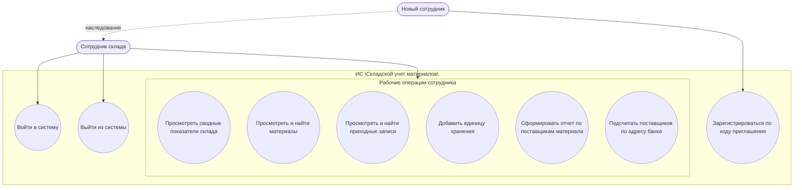

# Use Case информационной системы "Складской учет материалов"

## 1. Назначение системы

Информационная система "Складской учет материалов" предназначена для учета поступления материалов на склад, просмотра справочников, контроля поставщиков и формирования простых аналитических отчетов по складским операциям.

Система состоит из клиентского веб-приложения, API и базы данных PostgreSQL. Доступ к складским данным предоставляется только авторизованным пользователям.

## 2. Актеры

| Актер | Описание |
| --- | --- |
| Новый сотрудник | Пользователь, который получает код приглашения и регистрируется в системе. |
| Сотрудник склада | Авторизованный пользователь, который работает со складскими данными: просматривает справочники, добавляет приход и формирует отчеты. |
| Система авторизации | Внутренний механизм системы, который проверяет учетные данные, коды приглашения и токены доступа. |
| База данных | Хранилище справочников, приходных записей, поставщиков, единиц измерения и отчетных функций. |

## 3. Диаграмма Use Case

Готовая диаграмма сохранена в файле `UseCase_Warehouse.svg`.

Новый сотрудник связан с сотрудником склада отношением наследования. Все рабочие операции сотрудника выполняются после авторизации.

## 4. Перечень Use Case

| Код | Название | Актер | Краткое описание |
| --- | --- | --- | --- |
| UC-01 | Регистрация по коду приглашения | Новый сотрудник | Создание учетной записи сотрудника при наличии действительного кода приглашения. |
| UC-02 | Вход в систему | Сотрудник склада | Авторизация пользователя по почте и паролю. |
| UC-03 | Просмотр сводных показателей склада | Сотрудник склада | Просмотр количества материалов, поставщиков, складских единиц и общей суммы прихода. |
| UC-04 | Просмотр и поиск материалов | Сотрудник склада | Просмотр последних материалов и полного справочника с поиском по коду, названию, классу, группе и счету. |
| UC-05 | Просмотр и поиск приходных записей | Сотрудник склада | Просмотр последних поступлений и полного списка приходов с поиском. |
| UC-06 | Добавление единицы хранения | Сотрудник склада | Создание новой приходной записи на основании поставщика, материала, документа, количества и цены. |
| UC-07 | Формирование отчета по поставщикам материала | Сотрудник склада | Получение списка поставщиков выбранного материала с количеством и суммой поставок. |
| UC-08 | Подсчет поставщиков по адресу банка | Сотрудник склада | Расчет количества поставщиков, у которых банковский адрес совпадает с введенным адресом. |
| UC-09 | Выход из системы | Сотрудник склада | Завершение сеанса и очистка локального токена доступа. |

## 5. Подробные сценарии

### UC-01. Регистрация по коду приглашения

**Цель:** создать учетную запись нового сотрудника.

**Предусловия:** у пользователя есть код приглашения.

**Основной сценарий:**

1. Пользователь открывает форму регистрации.
2. Пользователь вводит почту, имя, пароль и код приглашения.
3. Система проверяет корректность почты.
4. Система проверяет, что пароль содержит не менее 6 символов.
5. Система проверяет код приглашения.
6. Система проверяет, что пользователь с такой почтой еще не зарегистрирован.
7. Система создает учетную запись.
8. Система выдает токен доступа и открывает рабочий экран.

**Альтернативные сценарии:**

| Условие | Реакция системы |
| --- | --- |
| Неверный код приглашения | Система выводит сообщение об ошибке. |
| Почта уже зарегистрирована | Система сообщает, что пользователь с такой почтой уже существует. |
| Пароль короче 6 символов | Система просит указать более длинный пароль. |
| Некорректная почта | Система не создает учетную запись. |

**Постусловие:** пользователь зарегистрирован и авторизован.

### UC-02. Вход в систему

**Цель:** предоставить сотруднику доступ к складским данным.

**Предусловия:** учетная запись сотрудника уже существует.

**Основной сценарий:**

1. Пользователь открывает форму входа.
2. Пользователь вводит почту и пароль.
3. Система проверяет учетные данные.
4. Система выдает токен доступа.
5. Система загружает данные пользователя и складские справочники.
6. Пользователь переходит на рабочий экран.

**Альтернативный сценарий:** если почта или пароль неверные, система выводит сообщение об ошибке и не открывает складские данные.

**Постусловие:** пользователь авторизован, токен сохранен в локальном хранилище браузера.

### UC-03. Просмотр сводных показателей склада

**Цель:** быстро оценить текущее состояние складского учета.

**Предусловия:** пользователь авторизован.

**Основной сценарий:**

1. Система загружает материалы, поставщиков и приходные записи.
2. Система рассчитывает количество материалов.
3. Система рассчитывает количество поставщиков.
4. Система рассчитывает количество единиц хранения.
5. Система рассчитывает общую сумму прихода.
6. Пользователь просматривает показатели на главном экране.

**Постусловие:** пользователь видит актуальную сводку по складу.

### UC-04. Просмотр и поиск материалов

**Цель:** найти нужный материал в справочнике.

**Предусловия:** пользователь авторизован, справочник материалов загружен.

**Основной сценарий:**

1. Пользователь просматривает блок последних материалов.
2. Пользователь открывает полный список материалов.
3. Пользователь вводит поисковый запрос.
4. Система фильтрует материалы по коду, названию, классу, группе или счету.
5. Пользователь просматривает найденные материалы.

**Постусловие:** пользователь получает информацию о материале и его учетном счете.

### UC-05. Просмотр и поиск приходных записей

**Цель:** найти складские поступления по известным параметрам.

**Предусловия:** пользователь авторизован, список приходных записей загружен.

**Основной сценарий:**

1. Пользователь просматривает последние приходные записи.
2. Пользователь открывает полный список приходов.
3. Пользователь вводит поисковый запрос.
4. Система фильтрует записи по номеру ордера, дате, поставщику, материалу, документу, количеству, цене или сумме.
5. Пользователь просматривает найденные записи.

**Постусловие:** пользователь видит нужные операции поступления материалов.

### UC-06. Добавление единицы хранения

**Цель:** зарегистрировать новое поступление материала на склад.

**Предусловия:** пользователь авторизован, справочники поставщиков, материалов, документов и единиц измерения доступны.

**Основной сценарий:**

1. Пользователь открывает форму добавления единицы хранения.
2. Пользователь указывает номер ордера и дату.
3. Пользователь выбирает поставщика.
4. Пользователь указывает балансовый счет.
5. Пользователь выбирает тип документа и вводит номер документа.
6. Пользователь выбирает материал.
7. Система подставляет учетный счет материала.
8. Пользователь выбирает единицу измерения, доступную для выбранного материала.
9. Пользователь вводит количество и цену.
10. Система проверяет корректность поставщика, документа, материала и единицы измерения.
11. Система проверяет, что количество и цена больше нуля.
12. Система проверяет уникальность номера ордера.
13. Система рассчитывает итоговую сумму как `quantity * unit_price`.
14. Система сохраняет новую приходную запись.
15. Система обновляет список приходов, показатели и отчет по выбранному материалу.

**Альтернативные сценарии:**

| Условие | Реакция системы |
| --- | --- |
| Номер ордера уже существует | Система не сохраняет запись и сообщает об ошибке. |
| Поставщик не найден | Система отклоняет добавление записи. |
| Материал не найден | Система отклоняет добавление записи. |
| Тип документа неизвестен | Система выводит ошибку. |
| Единица измерения не относится к выбранному материалу | Система выводит ошибку. |
| Количество или цена меньше либо равны нулю | Система выводит ошибку. |
| Счет материала не совпадает со справочником | Система выводит ошибку. |

**Постусловие:** новая единица хранения добавлена в складской приход.

### UC-07. Формирование отчета по поставщикам материала

**Цель:** определить поставщиков, которые поставляли выбранный материал.

**Предусловия:** пользователь авторизован, выбран материал.

**Основной сценарий:**

1. Пользователь выбирает материал для отчета.
2. Система подсчитывает количество уникальных поставщиков материала.
3. Система формирует список поставщиков по выбранному материалу.
4. Система группирует приходные записи по поставщикам.
5. Система рассчитывает общее количество и сумму поставок по каждому поставщику.
6. Пользователь просматривает отчет.

**Альтернативный сценарий:** если по материалу нет приходных записей, система показывает пустой список и количество поставщиков `0`.

**Постусловие:** пользователь видит поставщиков выбранного материала и суммы поставок.

### UC-08. Подсчет поставщиков по адресу банка

**Цель:** узнать, сколько поставщиков имеют указанный банковский адрес.

**Предусловия:** пользователь авторизован.

**Основной сценарий:**

1. Пользователь вводит индекс, город, улицу и дом банка.
2. Пользователь запускает расчет.
3. Система сравнивает введенный адрес с банковскими адресами поставщиков.
4. Система возвращает количество найденных поставщиков.
5. Пользователь просматривает результат.

**Альтернативный сценарий:** если совпадений нет, система возвращает значение `0`.

**Постусловие:** пользователь получает число поставщиков с указанным банковским адресом.

### UC-09. Выход из системы

**Цель:** завершить работу пользователя с системой.

**Предусловия:** пользователь авторизован.

**Основной сценарий:**

1. Пользователь нажимает кнопку выхода.
2. Система удаляет токен доступа из локального хранилища.
3. Система очищает загруженные складские данные на клиенте.
4. Система возвращает пользователя на экран входа.

**Постусловие:** пользователь больше не имеет доступа к рабочему экрану без повторной авторизации.

## 6. Бизнес-правила

| Код | Правило |
| --- | --- |
| BR-01 | Все операции со складскими данными доступны только после авторизации. |
| BR-02 | Регистрация доступна только по действительному коду приглашения. |
| BR-03 | Почта пользователя должна быть уникальной. |
| BR-04 | Пароль пользователя должен содержать не менее 6 символов. |
| BR-05 | Номер складского ордера должен быть уникальным. |
| BR-06 | Количество и цена единицы хранения должны быть больше нуля. |
| BR-07 | Учетный счет материала в приходной записи должен совпадать со справочником материалов. |
| BR-08 | Единица измерения должна относиться к выбранному материалу. |
| BR-09 | Итоговая сумма прихода рассчитывается как произведение количества на цену. |
| BR-10 | Поставщик, материал, тип документа и единица измерения должны существовать в справочниках. |

## 7. Связь Use Case с API

| Use Case | API |
| --- | --- |
| UC-01 | `POST /api/auth/register` |
| UC-02 | `POST /api/auth/login`, `GET /api/auth/me` |
| UC-03 | `GET /api/warehouse/materials`, `GET /api/warehouse/suppliers`, `GET /api/warehouse/storage-units` |
| UC-04 | `GET /api/warehouse/materials` |
| UC-05 | `GET /api/warehouse/storage-units` |
| UC-06 | `POST /api/warehouse/storage-units` |
| UC-07 | `GET /api/warehouse/materials/{materialCode}/supplier-count`, `GET /api/warehouse/materials/{materialCode}/suppliers` |
| UC-08 | `POST /api/warehouse/suppliers/bank-address-count` |
| UC-09 | Выполняется на клиенте через удаление локального токена. |
